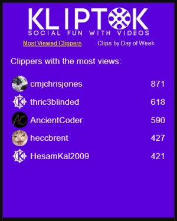
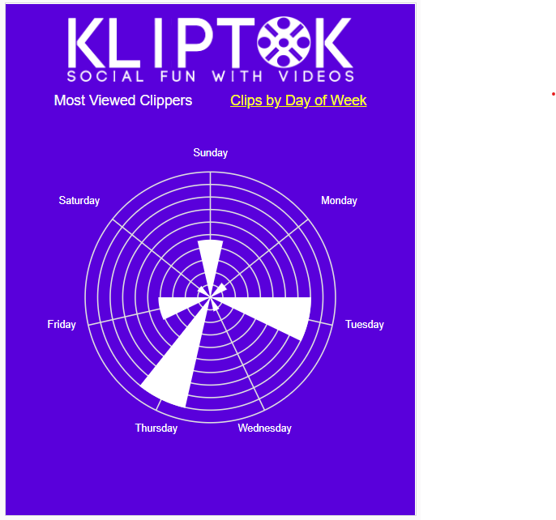

# KlipTok Twitch Extensions

This is the open-source repository that shows how we are building Twitch extensions that work with the [KlipTok](https://kliptok.com) application.

## KlipTok Dock

The KlipTok Dock is the first extension we are creating and it shows a simple set of dashboard data from KlipTok for the Twitch channel its embedded on.

### Most Viewed Clippers

This shows the individuals who have created clips, order by the total of the views of all of the clips they have created.

### Clips by Day of Week

This shows a radar column chart indicating which days of the week clips are created on.

